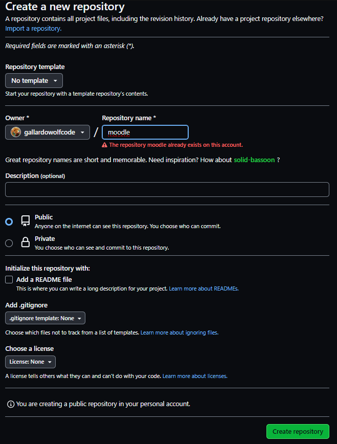

# INSTRUCCIONES PARA CLONAR Y CORRER DOCKER COMPOSE DE MOODLE

## ¿CÓMO CLONAR EL REPOSITORIO moodle?

## 1. Nos dirijimos a nuestro perfil de github y hacemos un repositorio nuevo llamado moodle

- Asignamos un nombre
- Indicamos si va a ser un repositorio privado o público
- Añadimos un archivo README.md
- Creamos el repositorio

## 2. CLONAR NUESTRO REPOSITORIO "moodle"

- Abrir repositorio moodle
- Seleccionar la opción code
- Utilizamos la opción HTTPS
- copiamos el código

https://github.com/gallardowolfcode/moodle.git

- Abrimos nuestra terminal y pegamos el código -- git clone
https://github.com/gallardowolfcode/moodle.git
- Abrimos nuestro entorno de Visual studio
code .

### Ejecutar docker compose

## 3. DOCKER COMPOSE
## 4. ARCHIVO DOCKER COMPOSE.YML
## 5. INSTRUCCIONES BÁSICAS PARA CREAR UN CURSO