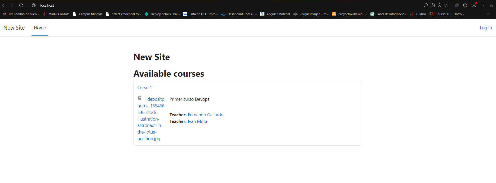

# INSTRUCCIONES PARA CLONAR Y CORRER DOCKER COMPOSE DE MOODLE

## ¿CÓMO CLONAR EL REPOSITORIO moodle?

## 1. Nos dirijimos a nuestro perfil de github y hacemos un repositorio nuevo llamado moodle

- Asignamos un nombre
- Indicamos si va a ser un repositorio privado o público
- Añadimos un archivo README.md
- Creamos el repositorio

## 2. CLONAR NUESTRO REPOSITORIO "moodle"

- Abrir repositorio moodle
- Seleccionar la opción code
- Utilizamos la opción HTTPS
- copiamos el código

https://github.com/gallardowolfcode/moodle.git

- Abrimos nuestra terminal y pegamos el código -- git clone

https://github.com/gallardowolfcode/moodle.git

- Abrimos nuestro entorno de Visual studio
code .

### Ejecutar docker compose

## 3. DOCKER COMPOSE

## 4. ARCHIVO DOCKER COMPOSE.YML
> Usaremos el comando: 
> cat docker-compose.yml

para verificar el contenido de nuestro archivo.

## 5. INSTRUCCIONES BÁSICAS PARA INICIAR MOODLE
- http://localhost:8080
- Username: user
- Password: bitnami
- 172.21.43.22:80

> Insertamos datos en el login

> configuramos perfil

## 6. CREANDO UN NUEVO CURSO
- En nuestro dashboard vamos a la sección de Add new course

- Al entrar a este menú vemos las opciones disponibles para describir el curso

- Llenamos los datos y damos continuar para su creación el cual nos aparece en la pantalla principal de cursos

### Con esto tenemos las instrucciones básicas para la creación de un curso en moodle con docker compose.